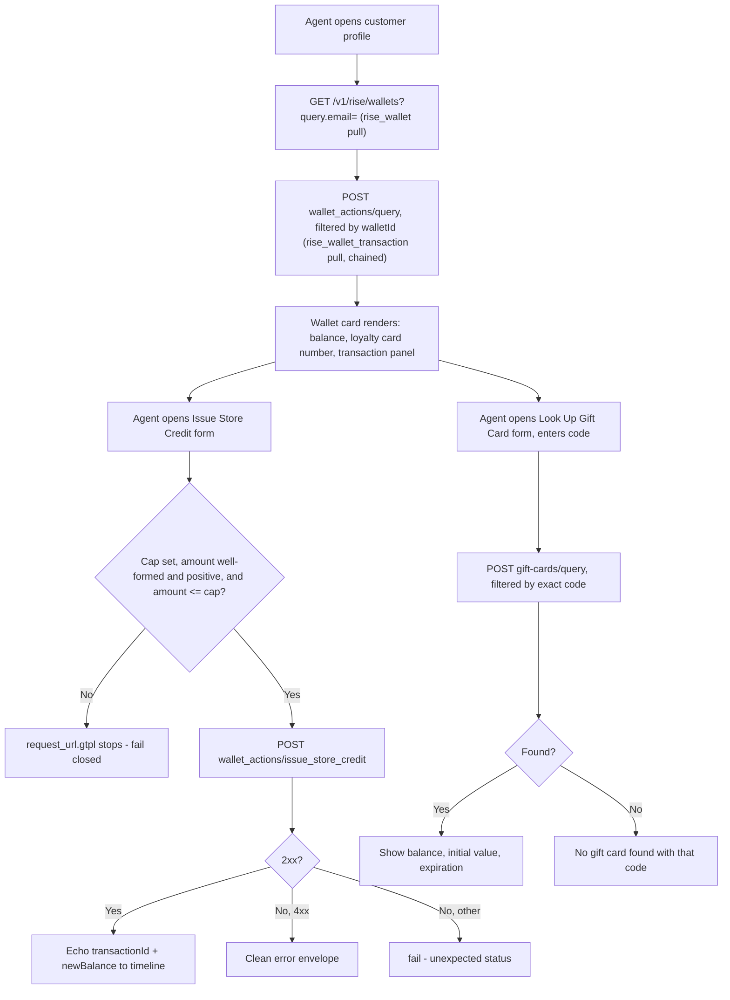

# Rise.ai Wallet App - Plan

## Goal Capsule

- **Objective:** build the v1 Rise.ai Gladly App Platform app to a green `make all` — a wallet
  card, one guarded money action, and a gift-card lookup action, per the locked scope.
- **Authority hierarchy:** `docs/rise/BUILD-SCOPE.md` is the frozen contract for WHAT to build;
  this plan and its implementer own only HOW. A conflict between this plan and BUILD-SCOPE.md
  resolves in BUILD-SCOPE.md's favor — flag it, don't silently follow the plan.
- **Stop conditions:** any change that would alter locked scope (add/remove a data field, add/
  remove an action, change the cap mechanism) is a scope change, not an implementation detail —
  stop and return to the human, don't decide it in-flight.
- **Execution profile:** standard `appcfg` build (validate/test/build); no live sandbox access
  during this plan's execution — see Verification Contract for what is and isn't in scope here.
- **Tail ownership:** this plan's Definition of Done is a green, locally-buildable app. Live
  sandbox verification (auth scheme, decimal format, double-count check) is stage 4 (`validate`)
  of the app-platform-factory pipeline, owned by a later invocation, not by this plan's executor.

---

## Product Contract

### Summary

Build a Gladly App Platform app for Rise.ai: one customer-profile card showing wallet (store
credit) balance, loyalty card number, and an expandable transaction ledger; a guarded agent
action to issue store credit; and an agent-invoked lookup action for gift card balance/expiration
by exact code (moved off the wallet card during implementation — see KTD11). Refund-to-credit and
direct gift-card balance adjustment are out of scope for this plan.

### Problem Frame

Rise.ai runs its own platform (`platform.rise.ai`) separate from Shopify, so Gladly agents
currently have no visibility into a customer's gift card or store credit balance and no way to
issue credit without leaving Gladly. Two named merchants (AG Jeans, Tula) surfaced this gap; the
scoping ledger locked a v1 answer to it (see origin: `docs/rise/BUILD-SCOPE.md`).

### Requirements

**Wallet visibility**
- R1. The app pulls the customer's Rise.ai wallet — store credit balance and loyalty card
  number — matched by customer email, on one customer-profile card. **Revised during
  implementation (KTD11):** gift card code/balance/expiration is delivered via a separate
  agent-invoked lookup action (U8), not nested on this card — live testing found no confirmed
  email-based link between a customer's wallet and their gift card.
- R2. The app pulls the wallet's transaction/ledger history as a chained detail data type,
  including reward-type entries labeled distinctly, rendered as an expandable panel on the same
  card (unified-card decision, see KTD4).

**Store credit issuance**
- R3. Agents can issue store credit to the wallet via a guarded action: a typed `approve`
  confirmation plus a merchant-configured per-transaction cap read from the admin config,
  fail-closed if the cap is unset or exceeded.
- R4. The action's result state echoes enough detail (new balance, Rise transaction id) that the
  Gladly timeline entry is a meaningful, auditable record.

### Scope Boundaries

- **Deferred to Follow-Up Work:** refund-to-credit (mechanism not confirmed to exist as a
  distinct endpoint) and direct gift-card `increase`/`decrease` (pending confirmation it doesn't
  double-book the wallet balance `issueStoreCredit` writes to). Both stay out of this plan's
  Implementation Units. (see origin: `docs/rise/BUILD-SCOPE.md`, Deferred section)
- **Outside this product's identity:** referral/referrer data and a standalone "loyalty points"
  balance — neither exists in Rise.ai's data model or the Gorgias parity anchor this scope was
  built against.

### Outstanding Questions

All items below are execution-time verification, not product/architecture blockers — none holds
back `implementation-ready`. They're pre-build gate items in `docs/rise/BUILD-SCOPE.md`, carried
here so the implementer doesn't lose them:

- ~~Auth header scheme: raw key vs. `Bearer`~~ **Resolved 2026-08-20, live:** confirmed `Bearer`
  against `platform.rise.ai` (a 404 proves auth passed). U1's `riseApiKey.gtpl` and its test
  fixtures updated. Also discovered live and fixed: the wallet lookup's query parameter is
  dot-notation (`query.email=`), not `email=` as originally assumed — neither the vendor docs
  research nor this plan anticipated that shape.
- `DECIMAL_VALUE` wire format and exact precision on the **wallet's** `balance` field
  specifically. **Deferred** to stage 4 — every live wallet probe hit a 404 "not found" case, so
  U2's response-transform assumption is still unverified (see the string-vs-number bullet below
  for what *is* now confirmed, for gift cards).
- ~~Wallet vs. gift-card double-count~~ **Resolved 2026-08-20, live (KTD11):** wallets and gift
  cards are independent Rise.ai objects with no confirmed link — not "linked but tracked
  separately," genuinely unrelated. There is no double-count risk because `issueStoreCredit`
  and gift card balances can never touch the same money. Gift card display moved to its own
  lookup action (U8) as a result.
- Whether the transaction-query endpoint filters server-side by wallet id (needed for U3's
  chaining) — if it doesn't, U3 falls back to client-side scoping. **Deferred**, contingency
  noted in U3.
- Key rotation/revocation ownership — organizational, not technical. **Deferred** to the ship
  stage handoff.
- Whether any Gladly agent with customer-profile access can issue credit up to the cap, or
  whether issuance should be gated to a specific agent permission/role. The plan defaults to
  "any profile-access agent can," matching how other GUARDED actions (recharge, rivo) have
  already shipped without role-gating — named explicitly rather than left an implicit
  assumption. **Deferred**, non-blocking.
- Whether `DECIMAL_VALUE` is guaranteed to serialize as a JSON **string** (not a bare number)
  for every Rise.ai monetary field this app touches. **Partially resolved 2026-08-20, live:**
  confirmed `STRING` for gift card fields (`balance`, `initialValue`) via dev.rise.ai's "Query
  Gift Cards" response schema, validating KTD5's typing decision for that data. The wallet's
  own `balance` field was never directly inspected (see the bullet above) — **deferred** to
  stage 4 for that specific field.
- Whether Rise.ai's `issue_store_credit` endpoint actually deduplicates server-side on the
  `idempotencyKey` sent (KTD9, revised — now the action's `.correlationId`), and whether
  `.correlationId` itself stays stable across a client-side resubmission after a timeout (the
  property the mechanism depends on) or is minted fresh per HTTP call. Offline tests can only
  prove the app sends a deterministic value per invocation, not that it's stable across retries
  or that Rise honors it. **Deferred** to stage 4 (doc-review, adversarial; refined U6).
- Whether the App Platform sends any agent-identifying header (e.g. an equivalent of the
  documented Gladly-Agent-Id header on the older Lookup Adaptor framework) to the vendor on
  outbound action requests. If it does, Rise.ai's own audit log gets agent attribution for free
  and KTD7's correction is stronger than stated; if this is Lookup-Adaptor-only, Gladly's own
  timeline remains the sole attribution mechanism. **Deferred** to stage 4 (found during U6
  research; not confirmed either way for appcfg-based apps).

### Sources

- `docs/rise/BUILD-SCOPE.md` — locked scope, GraphQL signatures, pre-build gate.
- `docs/rise/SCOPING.md` — citations, competitive-parity matrix, 3-lens review.
- Wallet card mockup (unified-card decision, KTD4): https://claude.ai/code/artifact/5e5f09be-87be-4560-93c3-5915f95a7e3a
- App Platform build conventions (paths and gotchas cited inline by unit): the
  `gladly-app-platform-app` skill's `references/app-anatomy.md`, `auth-and-oauth.md`,
  `schema-typing.md`, `response-and-status-handling.md`, `testing-and-validation.md`,
  `upgrading-and-forms.md`.

---

## Planning Contract

### Key Technical Decisions

- KTD1. Model the wallet as **two chained Data Types plus the card's own transaction panel**:
  `RiseWallet` (parent, pulled by email) → `RiseWalletTransaction` (child, `@parentId`-linked),
  mirroring the Stay list→detail chaining pattern. (session-settled: user-approved — resolves
  `docs/rise/BUILD-SCOPE.md` C10's requirement for a third Data Type beyond the original two)
  **`RiseWallet.id` is the field that closes the card→action loop**: it renders on the card
  (implicitly, as the pull's identity) and is the same value U6's agent form auto-selects as a
  single-option `select` input bound to the wallet pull — the platform has no "hidden" input
  type (only `text`/`select`/`checkbox` are valid, confirmed by `appcfg validate` at
  implementation time), so a one-option select is the closest equivalent to "auto-bound, not
  agent-typed" (see U6). This is the specific mechanism deepening flagged as missing: without
  naming this field, nothing threads a wallet identifier from the card into
  `issueStoreCredit`'s input.
- KTD2. Auth is a **static per-merchant API key** (`apiKey` + `riseAccountId` config fields), not
  OAuth. (session-settled: user-directed — chosen over an OAuth partnership with Rise.ai to avoid
  an external approval dependency on the critical path; C9)
- KTD3. `issueStoreCredit` ships the **GUARDED idiom**: `request_url.gtpl` reads the merchant cap
  from `.integration.configuration` and `stop`s before the request builds if the cap is unset,
  the requested amount exceeds it, or the amount is zero/negative/malformed (see the strict
  parsing rule below); `confirmationCopy` requires a typed `approve`. Per-transaction cap only
  for v1 — no cumulative/velocity limit. (session-settled: user-approved; C8, C12)
  - **Strict amount parsing (addendum, security review):** because amounts are `String`
    end-to-end (KTD5), the cap comparison must reject any non-canonical numeric string —
    trailing garbage, exponential notation, embedded currency symbols, whitespace — rather than
    permissively coerce it. A loosely-parsed comparison (e.g. `"50.00.01"` silently becoming
    `50`) would let a malformed amount slip past the cap undetected.
  - **P0 fixed during implementation (U5 code review — two independent reviewers, correctness
    and security, both found this):** the original regex (`^(0|[1-9][0-9]*)\.[0-9]{2}$`) had no
    upper bound on the integer part's digit count. `int64 (replace "." "" $amount)` is Sprig's
    `cast.ToInt64` → `strconv.ParseInt(s, 0, 64)` — base `0` means the conversion silently
    returns `0` (swallowing the error) on `int64` overflow, and correctness review additionally
    found it parses any string as octal when `strconv`'s base-0 rules apply. **Empirically
    confirmed exploitable**: a 50-digit amount made the cap check silently pass and reached
    `request_body.gtpl`'s raw (unbounded) `.inputs.amount`, completely defeating the merchant
    cap. Fixed by bounding the integer part to 7 digits
    (`^(0|[1-9][0-9]{0,6})\.[0-9]{2}$`, max `9,999,999.99`) — small enough that no valid amount
    can overflow `int64`, and the existing leading-zero rejection (already required to reject
    `"025.00"`-style malformed input) independently prevents the octal-misparse variant, since
    every value that passes the regex either is exactly `"0.00"` (handled by a separate check
    before the cap comparison) or starts with a nonzero digit. Verified live via
    `appcfg test` with a 50-digit amount (correctly rejected post-fix) and a boundary case
    (`1,000,000.00` vs. a `50.00` cap, correctly rejected for exceeding the cap, not misparsed).
  - **Guard-stop is a terminal state (addendum, architecture review):** a `stop` in
    `request_url.gtpl` aborts before any HTTP request is built or sent. It never reaches
    `response_transformation.gtpl` — KTD6's status-branching and KTD7's audit echo do not run
    for a guard-stopped submission. The agent sees the `stop` message directly as the action's
    error surface, not a synthesized 4xx/5xx result.
  - **Enforcement is request-build-time only, by platform constraint, not oversight
    (addendum, architecture review):** form templates cannot read
    `.integration.configuration` (a documented App Platform limitation — see
    `references/app-anatomy.md`), so the cap cannot be surfaced or pre-checked in U6's form UI.
    The agent always sees the form and discovers a cap violation only after typing `approve`
    and submitting; this is accepted, not a gap to close in this plan.
- KTD4. **One unified `flexible.card`** for wallet balance, gift card summary, expiration, loyalty
  card number, and an expandable transaction ledger — not split into separate cards.
  (session-settled: user-directed — chosen this session over a split-card design; matches the
  published mockup and the Gorgias parity anchor)
- KTD5. All monetary fields (`balance`, `amount`) are typed `String` in both schemas, never
  `Float` — this is the schema-typing decision, chosen on the assumption Rise's `DECIMAL_VALUE`
  serializes as a formatted string on the wire (see Schema typing, below). **Both the exact
  precision and the string-vs-bare-number wire representation itself are Outstanding
  Questions** — if stage 4 finds a bare JSON number instead of a string, this is a schema-field
  type correction, not just a precision fix (doc-review, adversarial).
- KTD6. `issueStoreCredit`'s response transform branches on `.response.statusCode` directly
  (actions expose native status + parsed `rawData`); the wallet and transaction pulls use the
  default 200-only path — no `rawResponse: true` — because no documented non-200 case exists for
  the wallet/transaction endpoints. If stage 4 discovers a real "no wallet" error code, this KTD
  is revisited then, not guessed now.
  - **Accepted v1 ambiguity (addendum, architecture review):** on this default path, a wallet
    pull failure collapses two very different customer states — "this customer has no Rise.ai
    wallet" (404, a legitimate business state) and "the merchant's API key is broken" (401/500,
    an integration fault) — into the same outcome: no card renders, and no diagnostic
    distinguishes them for the agent. Distinguishing them would require `rawResponse: true`
    handling; out of scope for this plan, named here so it isn't mistaken for an oversight at
    review time.
- KTD7. **Corrected during implementation (U5).** The `issueStoreCredit` result state echoes
  the Rise `transactionId` alongside the new balance, so the Gladly timeline entry is queryable
  against Rise's own audit log. It does **not** additionally echo "the acting agent's identity"
  as originally drafted here — feasibility and adversarial review independently found that
  action templates receive no context beyond integration secrets and explicit inputs (the same
  constraint KTD1 already worked around for `walletId`), and no documented mechanism exposes
  agent identity to `response_transformation.gtpl`. The attribution goal from
  `docs/rise/SCOPING.md` C13 still holds, but is met by Gladly's own conversation timeline,
  which already attributes every action event to the agent who triggered it as a platform-level
  feature — `transactionId` is the cross-reference key a human uses to correlate that
  already-attributed timeline entry with Rise's own audit log, not a field this action needs to
  fabricate.
- KTD8. **Shared monetary/null-guard convention, named once:** every response transform touching
  a Rise.ai monetary field renders it as a plain numeric string with no currency symbol at the
  vendor's native precision, and builds its output `dict` with always-present scalars first,
  then conditionally `set`s optional/nested objects only when they're real maps — the
  null-nested-field pattern in `references/response-and-status-handling.md`. U2 and U3 cite this
  convention rather than each restating it, so their implementations can't silently diverge
  (pattern review).
- KTD9. **Revised during implementation (U6).** `idempotencyKey` is not an agent-visible form
  field. Form templates only receive `data`/`actions`/`customer` — no request-scoped or random
  primitive exists there, and a `uuidv4`-generated value can't be snapshot-tested (`appcfg
  test`'s JSON comparison is exact-match, not partial). Instead, `request_body.gtpl` sends the
  action's own `.correlationId` as the idempotency key — a value the platform already provides
  per action invocation, deterministic in tests, and requiring no agent-facing field at all
  (simpler than the original hidden-field design). Whether `.correlationId` stays stable across
  a client-side resubmission after a timeout (the property this mechanism needs) is unconfirmed
  — see Outstanding Questions.
- KTD10. **Added during implementation (U2).** Auth header scheme and the wallet query
  parameter format, both live-confirmed 2026-08-20: `authorization: Bearer YOUR_API_TOKEN`
  (resolves the contested C4), and the query parameter is dot-notation
  (`query.email=...`/`query.wallet_id=...`/`query.customer_reference_source=...`), not a bare
  `email=` param as originally assumed from static vendor-docs research. Neither shape was
  guessable without live traffic.
- KTD11. **Architecture correction during implementation (U2, U4, U8).** The original design
  nested gift card info inside `RiseWallet` (KTD1's mockup-driven shape). Live testing proved
  this can't work: `GET /v1/rise/wallets?query.email=` 404s even for a customer with an active,
  real gift card, and Rise.ai's own docs show `Wallet` and `GiftCard` as independent object
  trees with separate CRUD endpoints — no confirmed email-based join exists between them (a
  `Recipient` object links `email` → `giftCardId`, but has no query-by-email endpoint, only
  get/create/delete by its own ID; a promising `POST /v1/rise/wallets/query_by_contact`
  endpoint that returns wallets with embedded `giftCardId`/`giftCardInfo` was tried with four
  different filter-shape guesses, all rejected as `UNSUPPORTED_FILTER` — its docs example is
  broken/non-representative). This matches an established cross-vendor precedent already in
  this factory's institutional learnings (ShipBob/ShipMonk, 2026-07): *when a vendor's data has
  no customer-identity lookup, deliver it as an agent-invoked lookup action, not an
  auto-pulling card.* Resolution: `RiseWallet` drops the `giftCard` field entirely (U2); gift
  card display becomes `lookupGiftCard`, a new agent-invoked action (U8) that looks up by exact
  code via the confirmed-working `POST /v1/rise/gift-cards/query` endpoint (`{"query":
  {"filter": {"code": "..."}}}`, live-confirmed against dev.rise.ai's "About API Query
  Language" doc). Same data ends up visible to the agent; the mechanism changed, not the scope.
  Real gift card field names (`code`, `balance`, `initialValue`, `currency`, `expirationDate`,
  `disableDate` — no explicit `status` field) are also live-confirmed from this pass and differ
  from the original snake_case guesses (`expires_at`, `status`).
- KTD12. **Partial reversal of KTD11, same day, new evidence (U2, U4).** The 404 that drove
  KTD11 turned out to be a false negative from testing against a gift card issued through a
  flow that never creates a wallet wrapper. Once a real wallet existed (created via Rise's
  "Issue Compensation" flow), `GET /v1/rise/wallets?query.email=` returned `200` with the gift
  card embedded: `{"wallet": {"id": ..., "giftCardId": ..., "giftCardInfo": {"code", "balance",
  "currency", "codeSuffix"}, ...}}`. Two live facts this corrects:
  - **The response is wrapped** (`rawData.wallet.*`), not a bare object — U2's original
    transform read `rawData.id` directly. Real bug, now fixed.
  - **A wallet has no distinct balance field of its own** — its "Store Credit" balance *is* the
    linked gift card's balance (`giftCardInfo.balance`). Rise's "Wallet" is a
    customer/compensation-tracking wrapper around one backing gift card, not a separate ledger.
  Net design, reconciling KTD11 and this finding: **both delivery mechanisms are correct, for
  different customer states.** `RiseWallet` gets a `giftCardCode` field (sourced from
  `giftCardInfo.code`) restored so a wallet-having customer's card shows it automatically; the
  defensive fallback checks for a hypothetical top-level `balance` first in case some wallet
  shape doesn't route through a gift card. U8's `lookupGiftCard` action **stays** — it's still
  the only path for a customer who has a bare gift card with no wallet wrapper at all (the
  case that originally triggered KTD11, confirmed still real and distinct from this one).
  `loyaltyCardNumber`'s source remains entirely unconfirmed — it was absent from every live
  response seen so far.

### High-Level Technical Design

The wallet card's data flow chains one pull into another, then the action writes back through a
guarded path before the timeline records it:

### Assumptions

- The wallet pull's `email` match behaves like Stay's (case-insensitive, one wallet per customer)
  — unconfirmed; if a customer can hold multiple wallets/currencies, U2's card-per-customer
  assumption needs revisiting at stage 4.
- The transaction-query endpoint accepts a wallet/customer id filter server-side (needed for
  U3's `@parentId` chaining to scope correctly) — if stage 4 disproves this, U3 falls back to
  pulling all transactions and filtering client-side in the response transform.

---

## Implementation Units

### U1. Scaffold app and auth headers

- **Goal:** stand up the app skeleton and the two static-credential headers every pull/action
  needs.
- **Requirements:** prerequisite for R1-R4.
- **Dependencies:** none.
- **Files:**
  - `apps/rise/app/manifest.json`
  - `apps/rise/app/authentication/headers/riseApiKey.gtpl`
  - `apps/rise/app/authentication/headers/riseAccountId.gtpl`
  - `apps/rise/app/authentication/headers/riseApiKey/_test_/data/{success,missing_api_key,blank_api_key}/`
  - `apps/rise/app/authentication/headers/riseAccountId/_test_/data/success/`
- **Approach:**
  1. Scaffold with `appcfg init` and `appcfg add auth-header` per the file-by-file anatomy.
  2. `riseApiKey.gtpl` emits `.integration.secrets.apiKey` with a `stop` guard on empty/missing
     (KTD2). Both header files are vendor-prefixed for consistent naming (pattern review).
  3. `riseAccountId.gtpl` emits `.integration.configuration.riseAccountId` as the
     `rise-account-id` header value.
  4. Default the key's wire format to the raw value the Auth guide shows, not the `Bearer`
     scheme the endpoint examples show — this is the Outstanding Question on auth scheme; the
     guard structure is identical either way, so the fix at stage 4 is a one-line template edit,
     not a rework.
- **Patterns to follow:** static-credential header idiom in `references/auth-and-oauth.md`.
- **Test scenarios:**
  - Header renders the configured key on success.
  - Missing `apiKey` secret stops with a legible message.
  - Blank/whitespace-only `apiKey` stops with a legible message.
  - `riseAccountId` header renders the configured account id.
- **Verification:** `appcfg validate` and `appcfg test` pass for the auth layer alone.

---

### U2. `rise_wallet` data pull

- **Goal:** define the wallet Data Type and pull it by customer email.
- **Requirements:** R1.
- **Dependencies:** U1.
- **Files:**
  - `apps/rise/app/data/data_schema.graphql` (adds `RiseWallet`, incl. `giftCardCode` — see
    KTD12)
  - `apps/rise/app/data/pull/wallet/config.json`
  - `apps/rise/app/data/pull/wallet/request_url.gtpl`
  - `apps/rise/app/data/pull/wallet/external_id.gtpl`
  - `apps/rise/app/data/pull/wallet/external_updated_at.gtpl`
  - `apps/rise/app/data/pull/wallet/response_transformation.gtpl`
  - `apps/rise/app/data/pull/wallet/_test_/{happy_path,no_loyalty_card,zero_balance}/`
- **Approach:**
  1. `request_url.gtpl` builds `GET /v1/rise/wallets?query.email=...` — **live-confirmed
     2026-08-20**: the real customer-context field is `.customer.primaryEmailAddress` (not
     `.email`), and the query parameter is dot-notation (`query.email=`), neither of which
     matched the original vendor-docs research.
  2. `response_transformation.gtpl` follows the shared convention in KTD8 for monetary fields.
     **Live-confirmed 2026-08-20 (KTD12):** the response is wrapped (`rawData.wallet.*`, not a
     bare object), and a wallet's balance/currency/code come from the embedded
     `giftCardInfo.{balance,currency,code}` — there's no distinct wallet-level balance field.
     Defensively checks for a top-level `balance` first before falling back to `giftCardInfo`.
     A customer with a bare gift card and no wallet wrapper still has no email-based path here —
     that case is served by U8's `lookupGiftCard` action instead.
  3. Default path (no `rawResponse`) per KTD6 — a non-200 fails the pull; **live-confirmed
     2026-08-20**: a nonexistent wallet is a real `404` with a `WALLET_NOT_FOUND` code, not a
     `200` with an empty body, exactly as KTD6 assumed.
- **Patterns to follow:** KTD8's shared convention; null-nested-field guard idiom in
  `references/response-and-status-handling.md`.
- **Test scenarios:**
  - Happy path: wallet with balance, expiration, loyalty card number.
  - Wallet with no loyalty card number — sibling fields still render.
  - Zero balance renders as `"0.00"`, not blank.
- **Verification:** `appcfg validate` and `appcfg test` green for this pull.

---

### U3. `rise_wallet_transaction` chained pull

- **Goal:** pull the wallet's transaction ledger as a detail Data Type chained to the wallet.
- **Requirements:** R2.
- **Dependencies:** U2.
- **Files:**
  - `apps/rise/app/data/data_schema.graphql` (adds `RiseWalletTransaction`, `transactions` field
    on `RiseWallet` via `@parentId`)
  - `apps/rise/app/data/pull/wallet_transactions/config.json` (`httpMethod: "POST"`)
  - `apps/rise/app/data/pull/wallet_transactions/request_url.gtpl`
  - `apps/rise/app/data/pull/wallet_transactions/external_id.gtpl`
  - `apps/rise/app/data/pull/wallet_transactions/external_parent_id.gtpl`
  - `apps/rise/app/data/pull/wallet_transactions/response_transformation.gtpl`
  - `apps/rise/app/data/pull/wallet_transactions/_test_/{multiple_entries,reward_entry,empty_ledger,null_note_field,malformed_row,no_parent_wallet}/`
    (flat under `_test_/`, not `_test_/data/` — the scaffold's real convention)
- **Approach:**
  1. `external_parent_id.gtpl` links each transaction row to the parent wallet id (KTD1).
  2. `request_url.gtpl`/body filters the query endpoint by the parent wallet id — the chaining
     key is `RiseWallet.id` (KTD1). Per the Outstanding Question, if the endpoint doesn't
     support a server-side filter, fall back to requesting all transactions and filtering by
     wallet id in the response transform instead.
  3. `response_transformation.gtpl` follows KTD8's shared convention and labels `REWARD`-type
     entries distinctly from `ISSUE`/`REDEEM` so the card can render them differently (supports
     KTD1's ledger-line loyalty treatment).
  4. **P1/P2 fixed during implementation (code review):** `request_body.gtpl` and
     `response_transformation.gtpl` both index `.externalData.rise_wallet` at position 0 without
     checking it's non-empty first — `index` on an empty slice is an unguarded template
     execution error (correctness + reliability review, independently). Both now `stop` with a
     clear message if the parent wallet is missing, converting a hard crash into a clean,
     testable failure. Also added a `kindIs "map" .` guard per transaction row before dotted
     field access, so one malformed/non-object row (reliability review) fails just that row
     instead of blanking the whole ledger.
- **Patterns to follow:** Stay's list→detail chaining in `references/concepts.md`; KTD8's shared
  convention.
- **Test scenarios:**
  - Multiple transactions of mixed types render with correct labels.
  - A `REWARD`-type entry is labeled distinctly.
  - Empty ledger (new wallet, no activity) renders an empty list, not an error.
  - A transaction with a null/missing `note` field doesn't blank the row.
  - A malformed row (`null`, a bare string) in the vendor's array is skipped, not fatal to the
    rest of the ledger (code review).
  - An empty parent wallet (`rise_wallet: []`) fails closed with a clear `stop` message instead
    of an unguarded index-out-of-range error (code review).
- **Verification:** `appcfg validate` and `appcfg test` green; confirm the parent-id link matches
  between this pull's fixtures and U2's wallet id (chaining gotcha from `concepts.md`).

---

### U4. Wallet card

- **Goal:** render the wallet balance, gift card code (when the wallet has one), loyalty card
  number, and an expandable transaction ledger as one customer-profile card.
- **Requirements:** R1, R2. **Revised twice during implementation** (see origin: wallet card
  mockup, linked in Sources): KTD11 moved gift card off this card into U8's lookup action after
  a 404 against a bare (walletless) gift card; KTD12 restored a `giftCardCode` field here, same
  day, once a real wallet showed the gift card actually comes back embedded in the wallet
  response when a wallet exists. Both are correct for different customer states — see KTD12.
- **Dependencies:** U2, U3.
- **Files:**
  - `apps/rise/app/ui/templates/wallet/config.json`
  - `apps/rise/app/ui/templates/wallet/flexible.card`
  - `apps/rise/app/ui/templates/wallet/_edit_/{default.json,no_loyalty_card.json,zero.json}`
- **Approach:**
  1. Store credit balance, gift card code (when present, KTD12), loyalty card number (when
     present), and a collapsible transaction panel.
  2. Guard every optional/nested field in the card the same way the response transform already
     guards them (U2/U3) — a card should never render "Something's wrong with this card" for a
     merely-absent gift card code or empty ledger.
- **Patterns to follow:** null-field card-blanking trap in
  `references/response-and-status-handling.md`.
- **Test scenarios:** `Test expectation: none — visual card verification isn't an `appcfg test`
  concern; see Verification below.`
- **Verification:** visual check via `appcfg edit ui-template wallet -d default -r apps/rise/app`
  (and `-d zero`, `-d no_loyalty_card`) — this is a human-eyeball step, not headless.

---

### U5. `issueStoreCredit` action

- **Goal:** let an agent issue store credit to the wallet, guarded by the per-transaction cap.
- **Requirements:** R3, R4.
- **Dependencies:** U1, U2 (wallet id is the action's required input).
- **Files:**
  - `apps/rise/app/actions/actions_schema.graphql` (adds `IssueStoreCreditResult` and a flat-arg
    `issueStoreCredit(walletId: String!, amount: String!, note: String, confirm: String!)`
    mutation — **not** the `input IssueStoreCreditInput!` wrapper drafted in
    `docs/rise/BUILD-SCOPE.md`; see correction below)
  - `apps/rise/app/actions/issue_store_credit/config.json`
  - `apps/rise/app/actions/issue_store_credit/request_url.gtpl`
  - `apps/rise/app/actions/issue_store_credit/request_body.gtpl`
  - `apps/rise/app/actions/issue_store_credit/response_transformation.gtpl`
  - `apps/rise/app/actions/issue_store_credit/_test_/{cap_ok,cap_exceeded,cap_unset,zero_amount,negative_amount,malformed_amount_trailing_garbage,malformed_amount_exponential,malformed_amount_leading_zeros,malformed_amount_currency_symbol,malformed_amount_whitespace,confirm_missing,confirm_mismatch,wallet_missing,success_full_object,success_bare_true,error_400,error_404,error_422,error_500,missing_amount,idempotency_resubmit}/`
    (flat under `_test_/`, not `_test_/data/` — the scaffold's real convention)
- **Approach:**
  1. `request_url.gtpl` `stop`s, in order, if: `walletId` is empty (defense in depth against the
     form's no-wallet placeholder, see U6); `confirm` isn't exactly `"approve"` (KTD3); the
     amount fails strict numeric parsing or is zero; the merchant cap is unset or invalid; or the
     amount exceeds the cap. A `stop` is terminal — the response transform never runs for a
     guarded submission (KTD3's guard-stop addendum).
  2. `request_body.gtpl` serializes `amount` as a string, plus `note` when present, plus
     `idempotencyKey` set to `.correlationId` (KTD9, revised — see below), and does **not**
     forward `confirm` to the vendor (Gladly-side gate only).
  3. `response_transformation.gtpl` branches on `.response.statusCode`: 2xx returns `success:
     true` plus `transactionId` and `newBalance` (KTD7, corrected — no agent-identity field; see
     above); the full 4xx range returns `success: false` plus a `message`; anything else `fail`s.
  4. **Implementation-time correction:** the mutation takes flat arguments, not an `input`
     wrapper object as drafted in `docs/rise/BUILD-SCOPE.md` — `appcfg validate`'s static
     template/schema cross-check rejects `.inputs.<field>` references under a wrapped input
     type. `.inputs.<x>` resolves directly to each flat argument.
  5. **Implementation-time correction:** the platform's template functions don't include Sprig's
     `atof`; the cap-vs-amount comparison converts both values to integer cents
     (`int64 (replace "." "" $amount)`) instead, exact for two-decimal amounts and avoiding
     floating-point comparison risk entirely.
  6. **Implementation-time correction (KTD9):** `idempotencyKey` is not a client-supplied input
     at all — it was dropped from the mutation's arguments. It's set from the action's own
     `.correlationId`, which `appcfg`'s action templates receive natively and which is
     deterministic in `_test_` fixtures (unlike a `uuidv4` generated in the form, which can't be
     snapshot-tested — see U6).
  7. **Implementation-time addition:** `confirm` (KTD3's typed-approve field) is a real mutation
     argument, checked via exact string equality — not part of the original drafted schema, but
     required to actually implement the GUARDED confirmation the ledger specified.
- **Execution note:** test-first for the cap-enforcement guard specifically — write the
  cap-exceeded, cap-unset, zero/negative-amount, and malformed-amount test cases before the
  `stop` logic passes them. This is the single point of failure preventing over-issuance (see
  Risks, below).
- **Patterns to follow:** the GUARDED idiom (`docs/rise/BUILD-SCOPE.md` C8); action
  status-branching in `references/response-and-status-handling.md`.
- **Test scenarios:**
  - Amount under the cap succeeds; amount exactly at the cap succeeds.
  - Amount over the cap, cap unset, zero amount, and negative amount are each blocked
    (fail-closed) before the request is sent, each with a distinct message (security review).
  - Malformed numeric-string amount is blocked: trailing garbage (`"50.00.01"`), exponential
    notation (`"5e3"`), leading zeros, and an embedded currency symbol each fail closed rather
    than being silently coerced (security review; KTD3 addendum). Surrounding whitespace is
    trimmed and then validated normally — trimming pure padding doesn't change the amount's
    value or introduce ambiguity the way the other malformed shapes do, so it's safe
    normalization rather than a coercion risk (implementation-time refinement).
  - Missing `confirm` and a case-mismatched `confirm` (`"Approve"`) are both blocked.
  - Empty `walletId` is blocked (defense in depth against U6's no-wallet placeholder option).
  - Vendor success in multiple shapes: full object, bare `true`.
  - Each of 400/404/422/500 produces a clean, distinct error envelope.
  - Missing `amount` input is rejected before the request is sent.
  - The same inputs (including the same `.correlationId`) produce byte-identical request bodies
    across repeated renders — proving the template has no hidden non-determinism that would
    defeat idempotency (KTD9, revised; this is what "idempotency_resubmit" actually verifies now
    that the key is platform-provided, not client-generated).
- **Verification:** `appcfg validate` and `appcfg test` green; the cap, confirm, and
  amount-validation tests together prove no code path reaches the vendor with an over-cap,
  unset-cap, zero, negative, malformed-amount, or unconfirmed request.

---

### U6. Agent form for issuing store credit

- **Goal:** surface `issueStoreCredit` in the compose "+" menu with the GUARDED confirmation.
- **Requirements:** R3.
- **Dependencies:** U4, U5.
- **Files:**
  - `apps/rise/app/ui/forms/issue-store-credit/config.json`
  - `apps/rise/app/ui/forms/issue-store-credit/form.gtpl`
  - `apps/rise/app/ui/forms/issue-store-credit/action_result.gtpl`
  - `apps/rise/app/ui/forms/issue-store-credit/_test_/{success,no_eligible,error}/`
- **Approach:**
  1. **Implementation-time correction:** there is no "hidden" input type — `appcfg`'s own
     validator (checking form output against the real action-form schema) accepts only
     `text`/`select`/`checkbox`. `walletId` is a single-option `select` bound to
     `.data.wallet.id`/`.balance`, the closest equivalent to "auto-bound, not agent-typed"
     available on this platform. The form also carries a free-text amount field (with a
     placeholder/hint showing the expected format, closing the design-review gap on
     format guidance), an optional note field, and a typed `approve` confirmation field, not
     Rise's own preset-amount buttons (KTD4's sibling decision, `docs/rise/BUILD-SCOPE.md` C14).
  2. **Implementation-time correction (KTD9):** no `idempotencyKey` field exists in this form at
     all — it was dropped in favor of the action's own `.correlationId` (see U5). This form only
     collects `walletId`, `amount`, `note`, `confirm`.
  3. Form templates can't read `.integration.configuration`, so the cap value itself can't be
     shown in the form copy dynamically — the cap enforcement lives entirely in U5's action
     template, not here. Note this as a known UX limitation, not a bug to fix in this unit.
  4. When the bound wallet pull returned nothing (no Rise.ai wallet for this customer, or the
     pull failed per KTD6's accepted ambiguity), the wallet `select` renders a single
     non-actionable placeholder option (`value: ""`, since the schema requires at least one
     option — an empty options array fails validation) rather than the platform's `no_eligible`
     state, which this form-config schema doesn't appear to expose. U5's action has a matching
     `walletId`-empty guard as defense in depth in case an agent submits anyway.
  5. `action_result.gtpl` returns `{"message", "detail"}` on success (new balance + transaction
     id) or `{"errors": [{"attr", "detail"}]}` on failure — `attr` turned out to be **required**
     by `appcfg validate` (the public docs call it optional for 400-style errors), so failures
     attach to the `confirm` field as the closest available anchor. The transaction ledger panel
     already rendered on the card (U4) does **not** auto-refresh after a successful issuance —
     the timeline entry is the authoritative visible record; seeing the new entry in the ledger
     panel itself requires the agent to reload the profile (flow review).
- **Patterns to follow:** `references/upgrading-and-forms.md` (form/action binding shape); the
  Stay auto-selected-`select` idiom in `references/app-anatomy.md`.
- **Test scenarios:**
  - Success state renders the new balance and transaction id.
  - Error state attaches the action's message to the form via `errors[0].detail`.
  - No-wallet state renders the single non-actionable placeholder option instead of erroring.
- **Verification:** `appcfg test ui-form` green.

---

### U7. Admin install form

- **Goal:** collect the merchant's Rise.ai credentials and per-transaction cap at install time.
- **Requirements:** prerequisite for R3 (the cap KTD3 reads).
- **Dependencies:** U1.
- **Files:**
  - `apps/rise/app/ui/admin/form.json`
- **Approach:**
  1. Required fields: `apiKey` (secret), `riseAccountId` (configuration).
  2. The per-transaction cap field must be **omittable** so "unset" is a valid, fail-closed
     state (KTD3) — per the admin-form optional trap, that means omitting the `optional` key
     entirely rather than setting `"optional": true`, which `appcfg validate`/`build` reject.
- **Patterns to follow:** `references/testing-and-validation.md` admin-form optional trap.
- **Test scenarios:** `Test expectation: none — admin form has no offline test dataset
  convention beyond validation.`
- **Verification:** `appcfg validate admin-ui` passes; cap field is genuinely optional (build
  doesn't reject it, and omitting it at install time doesn't error).

---

### U8. `lookupGiftCard` action and agent form

- **Goal:** let an agent look up a gift card by its exact code — the only path for a customer
  who has a bare gift card with no wallet wrapper (confirmed to happen; the case that
  originally drove KTD11). Complements, not replaces, U4's `giftCardCode` display for
  wallet-linked gift cards (KTD12).
- **Requirements:** R1 (gift card info for the walletless case; the wallet-linked case is
  covered by U4 directly per KTD12).
- **Dependencies:** U1.
- **Files:**
  - `apps/rise/app/actions/actions_schema.graphql` (adds `LookupGiftCardResult`,
    `lookupGiftCard` mutation)
  - `apps/rise/app/actions/lookup_gift_card/config.json`
  - `apps/rise/app/actions/lookup_gift_card/request_url.gtpl`
  - `apps/rise/app/actions/lookup_gift_card/request_body.gtpl`
  - `apps/rise/app/actions/lookup_gift_card/response_transformation.gtpl`
  - `apps/rise/app/actions/lookup_gift_card/_test_/{success,not_found,error_400,error_500,missing_code}/`
  - `apps/rise/app/ui/forms/lookup-gift-card/config.json`
  - `apps/rise/app/ui/forms/lookup-gift-card/form.gtpl`
  - `apps/rise/app/ui/forms/lookup-gift-card/action_result.gtpl`
  - `apps/rise/app/ui/forms/lookup-gift-card/_test_/{success,not_found}/`
- **Approach:**
  1. `request_url.gtpl` guards on a non-empty `code` input, then targets
     `POST /v1/rise/gift-cards/query` (confirmed-working endpoint, unlike the abandoned
     `query_by_contact` attempt in KTD11).
  2. `request_body.gtpl` builds `{"query": {"filter": {"code": "<code>"}}}` — the confirmed
     equality-filter shape from Rise's "API Query Language" doc.
  3. `response_transformation.gtpl` branches on `.response.statusCode` per the shared action
     pattern; on 2xx, checks the `giftCards[]` array — empty means "not found" (`success: true,
     found: false`, not an error, since a mistyped code is a normal outcome, not a failure), a
     match returns `found: true` plus the confirmed real field names.
  4. This is a read-only lookup exposed as a GraphQL Mutation, matching the platform's
     convention that `ui-form`'s `--action` binds to a Mutation field regardless of the
     underlying HTTP verb (same shape as the ShipMonk lookup-action precedent).
  5. `form.gtpl` is a single free-text "Gift card code" field with a hint telling the agent to
     ask the customer for it — no data-pull binding needed (unlike U6, which auto-selects the
     wallet).
- **Patterns to follow:** action status-branching in
  `references/response-and-status-handling.md`; the ShipBob/ShipMonk lookup-action precedent
  (`commands/app-platform-factory.md` §7) for the no-identity-lookup shape generally.
- **Test scenarios:**
  - A valid code returns the gift card's balance, initial value, currency, and expiration.
  - A code with no match returns `found: false` with a clean "no gift card found" message, not
    an error.
  - A 4xx from the vendor (e.g. a malformed filter) produces a clean error envelope.
  - A 5xx `fail`s per the shared action pattern.
  - An empty/missing code is rejected before the request is built.
- **Verification:** `appcfg validate`, `appcfg test`, and `appcfg test ui-form` green.

---

## Verification Contract

| Gate | Command | Applies to |
|---|---|---|
| Schema, config, template, admin-form structure | `appcfg validate -r apps/rise/app` | All units |
| Offline `_test_` datasets | `appcfg test -r apps/rise/app` | U1, U2, U3, U5, U6, U8 |
| Deployable artifact | `appcfg build -r apps/rise/app` | All units |
| Card visual check | `appcfg edit ui-template wallet -d default -r apps/rise/app` | U4 |
| Agent form check | `appcfg test ui-form` | U6, U8 |
| Admin form check | `appcfg validate admin-ui` | U7 |

**Explicitly not in this plan's verification scope** (stage 4 of the app-platform-factory
pipeline, not `ce-work`'s job here): `appcfg run data-graphql` / `appcfg run action-graphql`
against a live Rise.ai sandbox — the only path that resolves the remaining Outstanding Questions
(`DECIMAL_VALUE` precision, the double-count check — now resolved by KTD11's architecture finding
that wallets and gift cards are independent, so there is no double-count risk — and parent-id
filtering).

## Definition of Done

- `make all` (`appcfg validate && appcfg test && appcfg build`, run against `apps/rise/app`)
  exits 0.
- U4's card renders correctly in both the default and zero/empty states via the UI Template
  Visualizer.
- U6's and U8's forms pass `appcfg test ui-form` for their success and no-match states.
- U7's admin form passes `appcfg validate admin-ui` with the cap field genuinely optional.
- U5's cap-enforcement tests (cap-exceeded, cap-unset) prove no request reaches the vendor in
  either state.
- No dead-end or experimental code from abandoned approaches remains in the diff.
- The remaining Outstanding Questions are still open in this plan's Product Contract, not
  silently resolved by a guess — they carry into stage 4.

---

## Risks & Dependencies

- **Docs-lie-by-omission risk:** Rise.ai's docs have at least one self-contradiction (auth
  header scheme) already found at scope time; more may surface at stage 4. Mitigation: none of
  this plan's units assume undocumented behavior — every guess (auth scheme default, 200-only
  pull path) is named as an Outstanding Question, not baked in silently.
- **Money-movement risk:** `issueStoreCredit`'s cap is the only guard against over-issuance.
  Mitigation: U5's execution note requires the cap-exceeded, cap-unset, zero/negative, and
  malformed-amount tests to exist before the guard logic is considered done (KTD3).
- **Attribution risk:** the vendor's shared merchant-level API key means `transactionId` alone
  doesn't identify which Gladly agent triggered an issuance — it proves an issuance happened,
  not who caused it. Mitigation (revised, KTD7 — see Planning Contract): Gladly's own
  conversation timeline already attributes every action event to the triggering agent as a
  platform feature; `transactionId` is the cross-reference key, not a field this action fabricates.
- **Credential blast-radius risk (accepted):** the static per-merchant API key (KTD2) grants
  full read+write across the merchant's entire Rise.ai wallet system, not scoped to
  `issueStoreCredit` alone. This app's cap guard only governs requests this app builds — it
  provides no protection against direct misuse of a leaked key outside Gladly. Accepted as part
  of the auth-model sign-off; named explicitly here so a future unit adding a new Rise.ai action
  doesn't assume the existing guard extends to it.
- **Diagnostic ambiguity risk (accepted for v1):** a failed wallet pull renders identically
  whether the customer genuinely has no Rise.ai wallet or the merchant's API key is broken (see
  KTD6's addendum) — the agent has no way to tell the two apart from the missing card alone.
  Distinguishing them needs `rawResponse: true` handling, out of scope for this plan.
- **IDOR risk on `walletId` (accepted, platform-inherent — code review, security lens):** the
  action guards `walletId` is non-empty (U5) but has no way to re-verify it belongs to the
  customer whose profile is open — actions receive no customer context at all (the same
  constraint KTD1 already works around for wallet-id threading), so this can't be closed from
  inside the action template. A tampered or buggy client submitting a different wallet's id
  would have credit issued into it with no server-side detection at this layer. This is a
  platform-model limitation shared by every App Platform action with a caller-supplied id
  (Stay's `subscriptionId` has the identical shape), not specific to this app; named explicitly
  since the security review flagged it fresh rather than assuming it's already accepted elsewhere.
- **Opaque 5xx UX (accepted, matches shipped platform convention):** `response_transformation.gtpl`
  calls `fail(...)` on any non-2xx/4xx status (reliability review), which bypasses the
  `success`/`message` contract `action_result.gtpl` renders — an agent hitting a Rise.ai 500 gets
  whatever generic error surface the platform shows for a failed action, not a friendly "try
  again" message, and has no way to tell "safe to retry" from "may have already gone through."
  This matches the documented shipped idiom (`response-and-status-handling.md`: "reserve `fail`
  for 5xx/genuinely-unexpected") rather than being a gap introduced here; noted so it isn't
  mistaken for an oversight.
- **Dependency:** none on other Gladly apps or shared infrastructure — this is a greenfield,
  single-vendor build with no baseline to preserve.
