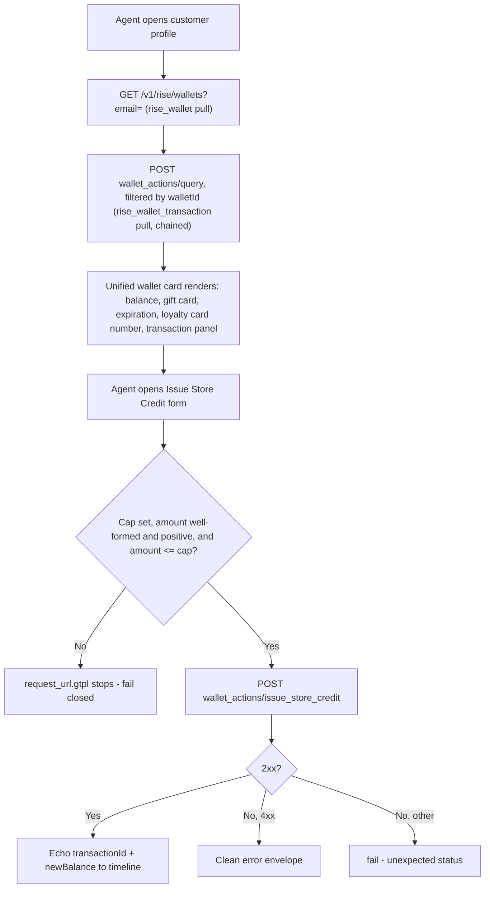

# Rise.ai Wallet App - Plan

## Goal Capsule

- **Objective:** build the v1 Rise.ai Gladly App Platform app to a green `make all` — a wallet
  card and one guarded money action, per the locked scope.
- **Authority hierarchy:** `docs/rise/BUILD-SCOPE.md` is the frozen contract for WHAT to build;
  this plan and its implementer own only HOW. A conflict between this plan and BUILD-SCOPE.md
  resolves in BUILD-SCOPE.md's favor — flag it, don't silently follow the plan.
- **Stop conditions:** any change that would alter locked scope (add/remove a data field, add/
  remove an action, change the cap mechanism) is a scope change, not an implementation detail —
  stop and return to the human, don't decide it in-flight.
- **Execution profile:** standard `appcfg` build (validate/test/build); no live sandbox access
  during this plan's execution — see Verification Contract for what is and isn't in scope here.
- **Tail ownership:** this plan's Definition of Done is a green, locally-buildable app. Live
  sandbox verification (auth scheme, decimal format, double-count check) is stage 4 (`validate`)
  of the app-platform-factory pipeline, owned by a later invocation, not by this plan's executor.

---

## Product Contract

### Summary

Build a Gladly App Platform app for Rise.ai: one customer-profile card showing wallet (store
credit) balance, linked gift card, expiration, loyalty card number, and an expandable transaction
ledger; one guarded agent action to issue store credit. Refund-to-credit and direct gift-card
balance adjustment are out of scope for this plan.

### Problem Frame

Rise.ai runs its own platform (`platform.rise.ai`) separate from Shopify, so Gladly agents
currently have no visibility into a customer's gift card or store credit balance and no way to
issue credit without leaving Gladly. Two named merchants (AG Jeans, Tula) surfaced this gap; the
scoping ledger locked a v1 answer to it (see origin: `docs/rise/BUILD-SCOPE.md`).

### Requirements

**Wallet visibility**
- R1. The app pulls the customer's Rise.ai wallet — store credit balance, linked gift card
  code/balance/expiration, loyalty card number — matched by customer email, on one
  customer-profile card.
- R2. The app pulls the wallet's transaction/ledger history as a chained detail data type,
  including reward-type entries labeled distinctly, rendered as an expandable panel on the same
  card (unified-card decision, see KTD4).

**Store credit issuance**
- R3. Agents can issue store credit to the wallet via a guarded action: a typed `approve`
  confirmation plus a merchant-configured per-transaction cap read from the admin config,
  fail-closed if the cap is unset or exceeded.
- R4. The action's result state echoes enough detail (new balance, Rise transaction id) that the
  Gladly timeline entry is a meaningful, auditable record.

### Scope Boundaries

- **Deferred to Follow-Up Work:** refund-to-credit (mechanism not confirmed to exist as a
  distinct endpoint) and direct gift-card `increase`/`decrease` (pending confirmation it doesn't
  double-book the wallet balance `issueStoreCredit` writes to). Both stay out of this plan's
  Implementation Units. (see origin: `docs/rise/BUILD-SCOPE.md`, Deferred section)
- **Outside this product's identity:** referral/referrer data and a standalone "loyalty points"
  balance — neither exists in Rise.ai's data model or the Gorgias parity anchor this scope was
  built against.

### Outstanding Questions

All items below are execution-time verification, not product/architecture blockers — none holds
back `implementation-ready`. They're pre-build gate items in `docs/rise/BUILD-SCOPE.md`, carried
here so the implementer doesn't lose them:

- Auth header scheme: raw key vs. `Bearer` — docs disagree with themselves. **Deferred** to stage
  4 live verification.
- `DECIMAL_VALUE` wire format on both the wallet pull (read) and the issue-credit action (write).
  **Deferred** to stage 4.
- Wallet vs. gift-card double-count — blocks trusting `issueStoreCredit`'s cap live, not blocks
  building it. **Deferred** to stage 4.
- Whether the transaction-query endpoint filters server-side by wallet id (needed for U3's
  chaining) — if it doesn't, U3 falls back to client-side scoping. **Deferred**, contingency
  noted in U3.
- Key rotation/revocation ownership — organizational, not technical. **Deferred** to the ship
  stage handoff.
- Whether any Gladly agent with customer-profile access can issue credit up to the cap, or
  whether issuance should be gated to a specific agent permission/role. The plan defaults to
  "any profile-access agent can," matching how other GUARDED actions (recharge, rivo) have
  already shipped without role-gating — named explicitly rather than left an implicit
  assumption. **Deferred**, non-blocking.
- Whether `DECIMAL_VALUE` is guaranteed to serialize as a JSON **string** (not a bare number)
  for every Rise.ai monetary field this app touches, distinct from the precision question above
  — KTD5's `String` typing decision assumes string representation; if stage 4 finds a bare
  number instead, that's a schema-field-type correction, not a template tweak. **Deferred** to
  stage 4 (doc-review, adversarial).
- Whether Rise.ai's `issue_store_credit` endpoint actually deduplicates server-side on a
  client-supplied `idempotencyKey` (KTD9), and what TTL, if any, applies relative to
  form-open-to-submit timing. Offline tests can only prove the app sends the same key twice, not
  that Rise honors it. **Deferred** to stage 4 (doc-review, adversarial).

### Sources

- `docs/rise/BUILD-SCOPE.md` — locked scope, GraphQL signatures, pre-build gate.
- `docs/rise/SCOPING.md` — citations, competitive-parity matrix, 3-lens review.
- Wallet card mockup (unified-card decision, KTD4): https://claude.ai/code/artifact/5e5f09be-87be-4560-93c3-5915f95a7e3a
- App Platform build conventions (paths and gotchas cited inline by unit): the
  `gladly-app-platform-app` skill's `references/app-anatomy.md`, `auth-and-oauth.md`,
  `schema-typing.md`, `response-and-status-handling.md`, `testing-and-validation.md`,
  `upgrading-and-forms.md`.

---

## Planning Contract

### Key Technical Decisions

- KTD1. Model the wallet as **two chained Data Types plus the card's own transaction panel**:
  `RiseWallet` (parent, pulled by email) → `RiseWalletTransaction` (child, `@parentId`-linked),
  mirroring the Stay list→detail chaining pattern. (session-settled: user-approved — resolves
  `docs/rise/BUILD-SCOPE.md` C10's requirement for a third Data Type beyond the original two)
  **`RiseWallet.id` is the field that closes the card→action loop**: it renders on the card
  (implicitly, as the pull's identity) and is the same value U6's agent form auto-selects as a
  hidden input bound to the wallet pull — the standard "form bound to a data pull, no customer
  context" idiom (see U6). This is the specific mechanism deepening flagged as missing: without
  naming this field, nothing threads a wallet identifier from the card into
  `issueStoreCredit`'s input.
- KTD2. Auth is a **static per-merchant API key** (`apiKey` + `riseAccountId` config fields), not
  OAuth. (session-settled: user-directed — chosen over an OAuth partnership with Rise.ai to avoid
  an external approval dependency on the critical path; C9)
- KTD3. `issueStoreCredit` ships the **GUARDED idiom**: `request_url.gtpl` reads the merchant cap
  from `.integration.configuration` and `stop`s before the request builds if the cap is unset,
  the requested amount exceeds it, or the amount is zero/negative/malformed (see the strict
  parsing rule below); `confirmationCopy` requires a typed `approve`. Per-transaction cap only
  for v1 — no cumulative/velocity limit. (session-settled: user-approved; C8, C12)
  - **Strict amount parsing (addendum, security review):** because amounts are `String`
    end-to-end (KTD5), the cap comparison must reject any non-canonical numeric string —
    trailing garbage, exponential notation, embedded currency symbols, whitespace — rather than
    permissively coerce it. A loosely-parsed comparison (e.g. `"50.00.01"` silently becoming
    `50`) would let a malformed amount slip past the cap undetected.
  - **Guard-stop is a terminal state (addendum, architecture review):** a `stop` in
    `request_url.gtpl` aborts before any HTTP request is built or sent. It never reaches
    `response_transformation.gtpl` — KTD6's status-branching and KTD7's audit echo do not run
    for a guard-stopped submission. The agent sees the `stop` message directly as the action's
    error surface, not a synthesized 4xx/5xx result.
  - **Enforcement is request-build-time only, by platform constraint, not oversight
    (addendum, architecture review):** form templates cannot read
    `.integration.configuration` (a documented App Platform limitation — see
    `references/app-anatomy.md`), so the cap cannot be surfaced or pre-checked in U6's form UI.
    The agent always sees the form and discovers a cap violation only after typing `approve`
    and submitting; this is accepted, not a gap to close in this plan.
- KTD4. **One unified `flexible.card`** for wallet balance, gift card summary, expiration, loyalty
  card number, and an expandable transaction ledger — not split into separate cards.
  (session-settled: user-directed — chosen this session over a split-card design; matches the
  published mockup and the Gorgias parity anchor)
- KTD5. All monetary fields (`balance`, `amount`) are typed `String` in both schemas, never
  `Float` — this is the schema-typing decision, chosen on the assumption Rise's `DECIMAL_VALUE`
  serializes as a formatted string on the wire (see Schema typing, below). **Both the exact
  precision and the string-vs-bare-number wire representation itself are Outstanding
  Questions** — if stage 4 finds a bare JSON number instead of a string, this is a schema-field
  type correction, not just a precision fix (doc-review, adversarial).
- KTD6. `issueStoreCredit`'s response transform branches on `.response.statusCode` directly
  (actions expose native status + parsed `rawData`); the wallet and transaction pulls use the
  default 200-only path — no `rawResponse: true` — because no documented non-200 case exists for
  the wallet/transaction endpoints. If stage 4 discovers a real "no wallet" error code, this KTD
  is revisited then, not guessed now.
  - **Accepted v1 ambiguity (addendum, architecture review):** on this default path, a wallet
    pull failure collapses two very different customer states — "this customer has no Rise.ai
    wallet" (404, a legitimate business state) and "the merchant's API key is broken" (401/500,
    an integration fault) — into the same outcome: no card renders, and no diagnostic
    distinguishes them for the agent. Distinguishing them would require `rawResponse: true`
    handling; out of scope for this plan, named here so it isn't mistaken for an oversight at
    review time.
- KTD7. **Corrected during implementation (U5).** The `issueStoreCredit` result state echoes
  the Rise `transactionId` alongside the new balance, so the Gladly timeline entry is queryable
  against Rise's own audit log. It does **not** additionally echo "the acting agent's identity"
  as originally drafted here — feasibility and adversarial review independently found that
  action templates receive no context beyond integration secrets and explicit inputs (the same
  constraint KTD1 already worked around for `walletId`), and no documented mechanism exposes
  agent identity to `response_transformation.gtpl`. The attribution goal from
  `docs/rise/SCOPING.md` C13 still holds, but is met by Gladly's own conversation timeline,
  which already attributes every action event to the agent who triggered it as a platform-level
  feature — `transactionId` is the cross-reference key a human uses to correlate that
  already-attributed timeline entry with Rise's own audit log, not a field this action needs to
  fabricate.
- KTD8. **Shared monetary/null-guard convention, named once:** every response transform touching
  a Rise.ai monetary field renders it as a plain numeric string with no currency symbol at the
  vendor's native precision, and builds its output `dict` with always-present scalars first,
  then conditionally `set`s optional/nested objects only when they're real maps — the
  null-nested-field pattern in `references/response-and-status-handling.md`. U2 and U3 cite this
  convention rather than each restating it, so their implementations can't silently diverge
  (pattern review).
- KTD9. **`idempotencyKey` is generated once per form instance, at form open, not per submit
  click**, and is reused on a resubmission of the same form (double-click, or retry after a
  timeout). Generating a fresh key per submit attempt would defeat the mechanism's purpose:
  a double-click or timeout-retry would mint two distinct, both-valid Rise.ai transactions
  instead of being deduplicated (flow review).

### High-Level Technical Design

The wallet card's data flow chains one pull into another, then the action writes back through a
guarded path before the timeline records it:

### Assumptions

- The wallet pull's `email` match behaves like Stay's (case-insensitive, one wallet per customer)
  — unconfirmed; if a customer can hold multiple wallets/currencies, U2's card-per-customer
  assumption needs revisiting at stage 4.
- The transaction-query endpoint accepts a wallet/customer id filter server-side (needed for
  U3's `@parentId` chaining to scope correctly) — if stage 4 disproves this, U3 falls back to
  pulling all transactions and filtering client-side in the response transform.

---

## Implementation Units

### U1. Scaffold app and auth headers

- **Goal:** stand up the app skeleton and the two static-credential headers every pull/action
  needs.
- **Requirements:** prerequisite for R1-R4.
- **Dependencies:** none.
- **Files:**
  - `apps/rise/app/manifest.json`
  - `apps/rise/app/authentication/headers/riseApiKey.gtpl`
  - `apps/rise/app/authentication/headers/riseAccountId.gtpl`
  - `apps/rise/app/authentication/headers/riseApiKey/_test_/data/{success,missing_api_key,blank_api_key}/`
  - `apps/rise/app/authentication/headers/riseAccountId/_test_/data/success/`
- **Approach:**
  1. Scaffold with `appcfg init` and `appcfg add auth-header` per the file-by-file anatomy.
  2. `riseApiKey.gtpl` emits `.integration.secrets.apiKey` with a `stop` guard on empty/missing
     (KTD2). Both header files are vendor-prefixed for consistent naming (pattern review).
  3. `riseAccountId.gtpl` emits `.integration.configuration.riseAccountId` as the
     `rise-account-id` header value.
  4. Default the key's wire format to the raw value the Auth guide shows, not the `Bearer`
     scheme the endpoint examples show — this is the Outstanding Question on auth scheme; the
     guard structure is identical either way, so the fix at stage 4 is a one-line template edit,
     not a rework.
- **Patterns to follow:** static-credential header idiom in `references/auth-and-oauth.md`.
- **Test scenarios:**
  - Header renders the configured key on success.
  - Missing `apiKey` secret stops with a legible message.
  - Blank/whitespace-only `apiKey` stops with a legible message.
  - `riseAccountId` header renders the configured account id.
- **Verification:** `appcfg validate` and `appcfg test` pass for the auth layer alone.

---

### U2. `rise_wallet` data pull

- **Goal:** define the wallet Data Type and pull it by customer email.
- **Requirements:** R1.
- **Dependencies:** U1.
- **Files:**
  - `apps/rise/app/data/data_schema.graphql` (adds `RiseWallet`, `RiseGiftCardSummary`)
  - `apps/rise/app/data/pull/wallet/config.json`
  - `apps/rise/app/data/pull/wallet/request_url.gtpl`
  - `apps/rise/app/data/pull/wallet/external_id.gtpl`
  - `apps/rise/app/data/pull/wallet/external_updated_at.gtpl`
  - `apps/rise/app/data/pull/wallet/response_transformation.gtpl`
  - `apps/rise/app/data/pull/wallet/_test_/data/{happy_path,no_gift_card,no_loyalty_card,zero_balance}/`
- **Approach:**
  1. `request_url.gtpl` builds `GET /v1/rise/wallets` with `email={{.customer.email}}`.
  2. `response_transformation.gtpl` follows the shared convention in KTD8 for monetary fields
     and null-nested guarding.
  3. Default path (no `rawResponse`) per KTD6 — a non-200 fails the pull until stage 4 proves
     otherwise; see KTD6's addendum on the accepted no-wallet/broken-key ambiguity this implies.
- **Patterns to follow:** KTD8's shared convention; null-nested-field guard idiom in
  `references/response-and-status-handling.md`.
- **Test scenarios:**
  - Happy path: wallet with balance, linked gift card, expiration, loyalty card number.
  - Wallet with no linked gift card — total absence of the nested object; card still renders,
    gift card fields absent, not null-erroring.
  - Gift card present but one nested field (`loyaltyCardNumber`) is null — sibling fields
    (balance, code, expiration) still render. Distinct from the total-absence case above
    (pattern review).
  - Zero balance renders as `"0.00"` (or whatever stage-4 confirms), not blank.
- **Verification:** `appcfg validate` and `appcfg test` green for this pull.

---

### U3. `rise_wallet_transaction` chained pull

- **Goal:** pull the wallet's transaction ledger as a detail Data Type chained to the wallet.
- **Requirements:** R2.
- **Dependencies:** U2.
- **Files:**
  - `apps/rise/app/data/data_schema.graphql` (adds `RiseWalletTransaction`, `transactions` field
    on `RiseWallet` via `@parentId`)
  - `apps/rise/app/data/pull/wallet_transactions/config.json` (`httpMethod: "POST"`)
  - `apps/rise/app/data/pull/wallet_transactions/request_url.gtpl`
  - `apps/rise/app/data/pull/wallet_transactions/external_id.gtpl`
  - `apps/rise/app/data/pull/wallet_transactions/external_parent_id.gtpl`
  - `apps/rise/app/data/pull/wallet_transactions/response_transformation.gtpl`
  - `apps/rise/app/data/pull/wallet_transactions/_test_/data/{multiple_entries,reward_entry,empty_ledger,no_gift_card_linked,null_note_field}/`
- **Approach:**
  1. `external_parent_id.gtpl` links each transaction row to the parent wallet id (KTD1).
  2. `request_url.gtpl`/body filters the query endpoint by the parent wallet id — the chaining
     key is `RiseWallet.id` (KTD1), not a gift-card id, so this pull runs whenever the parent
     wallet pull succeeds, regardless of whether a gift card is linked (pattern review). Per the
     Outstanding Question, if the endpoint doesn't support a server-side filter, fall back to
     requesting all transactions and filtering by wallet id in the response transform instead.
  3. `response_transformation.gtpl` follows KTD8's shared convention and labels `REWARD`-type
     entries distinctly from `ISSUE`/`REDEEM` so the card can render them differently (supports
     KTD1's ledger-line loyalty treatment).
- **Patterns to follow:** Stay's list→detail chaining in `references/concepts.md`; KTD8's shared
  convention.
- **Test scenarios:**
  - Multiple transactions of mixed types render with correct labels.
  - A `REWARD`-type entry is labeled distinctly.
  - Wallet has no linked gift card — this pull still runs and returns the wallet's own
    transactions, independent of gift-card presence (integration scenario; pattern review).
  - Empty ledger (new wallet, no activity) renders an empty list, not an error.
  - A transaction with a null/missing `note` field doesn't blank the row.
- **Verification:** `appcfg validate` and `appcfg test` green; confirm the parent-id link matches
  between this pull's fixtures and U2's wallet id (chaining gotcha from `concepts.md`).

---

### U4. Unified wallet card

- **Goal:** render the wallet, linked gift card, and an expandable transaction ledger as one
  customer-profile card (KTD4).
- **Requirements:** R1, R2. (see origin: wallet card mockup, linked in Sources)
- **Dependencies:** U2, U3.
- **Files:**
  - `apps/rise/app/ui/templates/wallet/config.json`
  - `apps/rise/app/ui/templates/wallet/flexible.card`
  - `apps/rise/app/ui/templates/wallet/_edit_/{default.json,zero.json}`
  - `apps/rise/app/ui/templates/wallet/_test_/{default.json,zero.json}`
- **Approach:**
  1. Mirror the published mockup's layout: two balance cells (store credit, gift card), a field
     list (gift card code, expiration, loyalty card number), a collapsible transaction panel.
  2. Guard every optional/nested field in the card the same way the response transform already
     guards them (U2/U3) — a card should never render "Something's wrong with this card" for a
     merely-absent gift card or empty ledger.
- **Patterns to follow:** the published mockup (Sources); null-field card-blanking trap in
  `references/response-and-status-handling.md`.
- **Test scenarios:** `Test expectation: none — visual card verification isn't an `appcfg test`
  concern; see Verification below.`
- **Verification:** visual check via `appcfg edit ui-template wallet -d default -r apps/rise/app`
  (and `-d zero` for the empty-wallet state) — this is a human-eyeball step, not headless.

---

### U5. `issueStoreCredit` action

- **Goal:** let an agent issue store credit to the wallet, guarded by the per-transaction cap.
- **Requirements:** R3, R4.
- **Dependencies:** U1, U2 (wallet id is the action's required input).
- **Files:**
  - `apps/rise/app/actions/actions_schema.graphql` (adds `IssueStoreCreditInput`,
    `IssueStoreCreditResult`, `issueStoreCredit` mutation — signatures already drafted in
    `docs/rise/BUILD-SCOPE.md`)
  - `apps/rise/app/actions/issue_store_credit/config.json`
  - `apps/rise/app/actions/issue_store_credit/request_url.gtpl`
  - `apps/rise/app/actions/issue_store_credit/request_body.gtpl`
  - `apps/rise/app/actions/issue_store_credit/response_transformation.gtpl`
  - `apps/rise/app/actions/issue_store_credit/_run_/data/default/inputs.json`
  - `apps/rise/app/actions/issue_store_credit/_test_/data/{cap_ok,cap_exceeded,cap_unset,zero_amount,negative_amount,malformed_amount,success_full_object,success_bare_true,error_400,error_404,error_422,error_500,missing_amount,idempotency_resubmit}/`
- **Approach:**
  1. `request_url.gtpl` reads the merchant cap from `.integration.configuration` and `stop`s
     before building the request if the cap is unset, the input amount exceeds it, or the
     amount is zero, negative, or a malformed numeric string (KTD3's strict-parsing addendum).
     A `stop` here is terminal — the response transform never runs for a guarded submission
     (KTD3's guard-stop addendum).
  2. `request_body.gtpl` serializes `amount` as a string, plus `note` and `idempotencyKey`
     (KTD5, KTD9) — the exact precision match is an Outstanding Question, not a build blocker.
     `idempotencyKey` is generated once per form instance at open time and reused on
     resubmission (KTD9) — U6 owns the generation point, this unit just passes it through.
  3. `response_transformation.gtpl` branches on `.response.statusCode`: 2xx returns `success:
     true` plus `transactionId` and `newBalance` (KTD7, corrected — no agent-identity field; see
     above); the full 4xx range returns `success: false` plus a `message`; anything else `fail`s.
  4. **Implementation-time correction:** the mutation takes flat arguments
     (`issueStoreCredit(walletId: String!, amount: String!, note: String, idempotencyKey:
     String!)`), not an `input IssueStoreCreditInput!` wrapper object as drafted in
     `docs/rise/BUILD-SCOPE.md` — `appcfg validate`'s static template/schema cross-check rejects
     `.inputs.<field>` references when they're wrapped in an unwrapped input type. `.inputs.<x>`
     resolves directly to each flat argument.
  5. **Implementation-time correction:** the platform's template functions don't include Sprig's
     `atof`; the cap-vs-amount comparison converts both values to integer cents
     (`int64 (replace "." "" $amount)`) instead, which is exact for two-decimal amounts and
     avoids floating-point comparison risk entirely.
- **Execution note:** test-first for the cap-enforcement guard specifically — write the
  cap-exceeded, cap-unset, zero/negative-amount, and malformed-amount test cases before the
  `stop` logic passes them. This is the single point of failure preventing over-issuance (see
  Risks, below).
- **Patterns to follow:** the GUARDED idiom (`docs/rise/BUILD-SCOPE.md` C8); action
  status-branching in `references/response-and-status-handling.md`.
- **Test scenarios:**
  - Amount under the cap succeeds.
  - Amount exactly at the cap succeeds.
  - Amount over the cap is blocked before the request is sent.
  - Cap unset is blocked (fail-closed) before the request is sent.
  - Zero amount is blocked (fail-closed), same guard path as an over-cap amount, not folded
    into "missing/empty input" (security review).
  - Negative amount is blocked (fail-closed) — a negative "issuance" would function as an
    undisclosed debit if it slipped past a purely numeric cap comparison (security review).
  - Malformed numeric-string amount is blocked: trailing garbage (`"50.00.01"`), exponential
    notation (`"5e3"`), leading zeros, and an embedded currency symbol each fail closed rather
    than being silently coerced (security review; KTD3 addendum). Surrounding whitespace is
    trimmed and then validated normally — trimming pure padding doesn't change the amount's
    value or introduce ambiguity the way the other malformed shapes do, so it's safe
    normalization rather than a coercion risk (implementation-time refinement).
  - Vendor success in multiple shapes: full object, bare `true`, `{}`.
  - Each of 400/404/422/500 produces a clean, distinct error envelope.
  - Missing or empty `amount` input is rejected before the request is sent.
  - A resubmission of the same form instance (same `idempotencyKey`) after a simulated timeout
    does not produce a second distinct request (KTD9; flow review).
- **Verification:** `appcfg validate` and `appcfg test` green; the cap and amount-validation
  tests together prove no code path reaches the vendor with an over-cap, unset-cap, zero,
  negative, or malformed-amount request.

---

### U6. Agent form for issuing store credit

- **Goal:** surface `issueStoreCredit` in the compose "+" menu with the GUARDED confirmation.
- **Requirements:** R3.
- **Dependencies:** U4, U5.
- **Files:**
  - `apps/rise/app/ui/forms/issue-store-credit/config.json`
  - `apps/rise/app/ui/forms/issue-store-credit/form.gtpl`
  - `apps/rise/app/ui/forms/issue-store-credit/action_result.gtpl`
  - `apps/rise/app/ui/forms/issue-store-credit/_test_/{success,missing_wallet}/`
- **Approach:**
  1. `form.gtpl` auto-selects `RiseWallet.id` as a hidden input bound to the wallet data pull —
     the standard "form bound to a data pull, no customer context" idiom — closing the
     card→action loop KTD1 names. It also carries a free-text amount field, a note field, and a
     typed `approve` confirmation field, not Rise's own preset-amount buttons (KTD4's sibling
     decision, `docs/rise/BUILD-SCOPE.md` C14). The `idempotencyKey` (KTD9) is generated once
     when the form opens and persists across resubmission of the same form instance.
  2. Form templates can't read `.integration.configuration`, so the cap value itself can't be
     shown in the form copy dynamically — the cap enforcement lives entirely in U5's action
     template, not here. Note this as a known UX limitation, not a bug to fix in this unit.
  3. When the bound wallet pull returned nothing (no Rise.ai wallet for this customer, or the
     pull failed per KTD6's accepted ambiguity), the form has no eligible wallet to select and
     enters the platform's standard `no_eligible` state — the agent never reaches the
     amount/approve fields against a missing target, rather than discovering the failure after
     submitting (flow review; this is what closes the "no-wallet form state" gap).
  4. `action_result.gtpl` renders the new balance and transaction id on the timeline. The
     transaction ledger panel already rendered on the card (U4) does **not** auto-refresh after
     a successful issuance — the timeline entry is the authoritative visible record of the
     action; seeing the new entry in the ledger panel itself requires the agent to reload the
     profile. Stated explicitly so it isn't mistaken for a bug (flow review).
- **Patterns to follow:** `references/upgrading-and-forms.md` (form/action binding shape);
  the `no_eligible` form-state convention in `references/testing-and-validation.md`.
- **Test scenarios:**
  - Success state renders the new balance and confirmation.
  - `no_eligible` state when the bound wallet pull returned nothing.
- **Verification:** `appcfg test ui-form` green.

---

### U7. Admin install form

- **Goal:** collect the merchant's Rise.ai credentials and per-transaction cap at install time.
- **Requirements:** prerequisite for R3 (the cap KTD3 reads).
- **Dependencies:** U1.
- **Files:**
  - `apps/rise/app/ui/admin/form.json`
- **Approach:**
  1. Required fields: `apiKey` (secret), `riseAccountId` (configuration).
  2. The per-transaction cap field must be **omittable** so "unset" is a valid, fail-closed
     state (KTD3) — per the admin-form optional trap, that means omitting the `optional` key
     entirely rather than setting `"optional": true`, which `appcfg validate`/`build` reject.
- **Patterns to follow:** `references/testing-and-validation.md` admin-form optional trap.
- **Test scenarios:** `Test expectation: none — admin form has no offline test dataset
  convention beyond validation.`
- **Verification:** `appcfg validate admin-ui` passes; cap field is genuinely optional (build
  doesn't reject it, and omitting it at install time doesn't error).

---

## Verification Contract

| Gate | Command | Applies to |
|---|---|---|
| Schema, config, template, admin-form structure | `appcfg validate -r apps/rise/app` | All units |
| Offline `_test_` datasets | `appcfg test -r apps/rise/app` | U1, U2, U3, U5, U6 |
| Deployable artifact | `appcfg build -r apps/rise/app` | All units |
| Card visual check | `appcfg edit ui-template wallet -d default -r apps/rise/app` | U4 |
| Agent form check | `appcfg test ui-form` | U6 |
| Admin form check | `appcfg validate admin-ui` | U7 |

**Explicitly not in this plan's verification scope** (stage 4 of the app-platform-factory
pipeline, not `ce-work`'s job here): `appcfg run data-graphql` / `appcfg run action-graphql`
against a live Rise.ai sandbox — the only path that resolves the Outstanding Questions (auth
scheme, `DECIMAL_VALUE` precision, the double-count check, parent-id filtering).

## Definition of Done

- `make all` (`appcfg validate && appcfg test && appcfg build`, run against `apps/rise/app`)
  exits 0.
- U4's card renders correctly in both the default and zero/empty states via the UI Template
  Visualizer.
- U6's form passes `appcfg test ui-form` for both success and no-wallet states.
- U7's admin form passes `appcfg validate admin-ui` with the cap field genuinely optional.
- U5's cap-enforcement tests (cap-exceeded, cap-unset) prove no request reaches the vendor in
  either state.
- No dead-end or experimental code from abandoned approaches remains in the diff.
- The six Outstanding Questions are still open in this plan's Product Contract, not silently
  resolved by a guess — they carry into stage 4.

---

## Risks & Dependencies

- **Docs-lie-by-omission risk:** Rise.ai's docs have at least one self-contradiction (auth
  header scheme) already found at scope time; more may surface at stage 4. Mitigation: none of
  this plan's units assume undocumented behavior — every guess (auth scheme default, 200-only
  pull path) is named as an Outstanding Question, not baked in silently.
- **Money-movement risk:** `issueStoreCredit`'s cap is the only guard against over-issuance.
  Mitigation: U5's execution note requires the cap-exceeded, cap-unset, zero/negative, and
  malformed-amount tests to exist before the guard logic is considered done (KTD3).
- **Attribution risk:** the vendor's shared merchant-level API key means `transactionId` alone
  doesn't identify which Gladly agent triggered an issuance — it proves an issuance happened,
  not who caused it. Mitigation: built into this plan, not deferred — U5/U7 echo the acting
  agent's identity into the result state alongside `transactionId` (KTD7).
- **Credential blast-radius risk (accepted):** the static per-merchant API key (KTD2) grants
  full read+write across the merchant's entire Rise.ai wallet system, not scoped to
  `issueStoreCredit` alone. This app's cap guard only governs requests this app builds — it
  provides no protection against direct misuse of a leaked key outside Gladly. Accepted as part
  of the auth-model sign-off; named explicitly here so a future unit adding a new Rise.ai action
  doesn't assume the existing guard extends to it.
- **Diagnostic ambiguity risk (accepted for v1):** a failed wallet pull renders identically
  whether the customer genuinely has no Rise.ai wallet or the merchant's API key is broken (see
  KTD6's addendum) — the agent has no way to tell the two apart from the missing card alone.
  Distinguishing them needs `rawResponse: true` handling, out of scope for this plan.
- **Dependency:** none on other Gladly apps or shared infrastructure — this is a greenfield,
  single-vendor build with no baseline to preserve.
